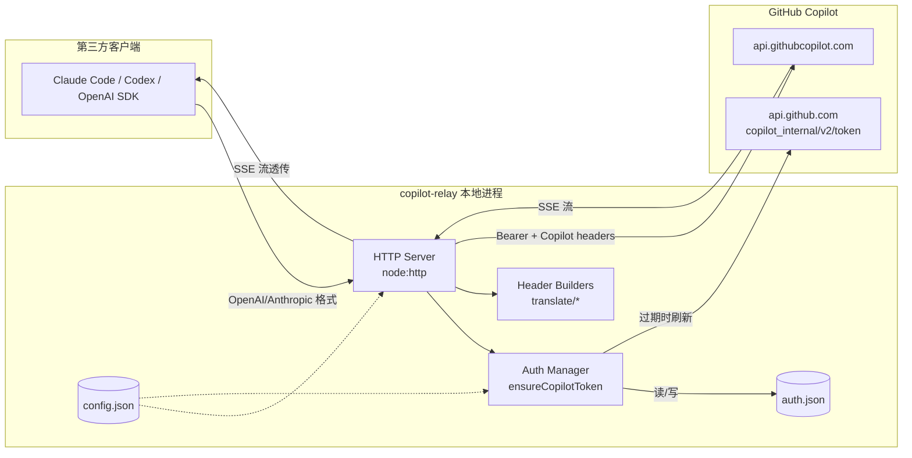
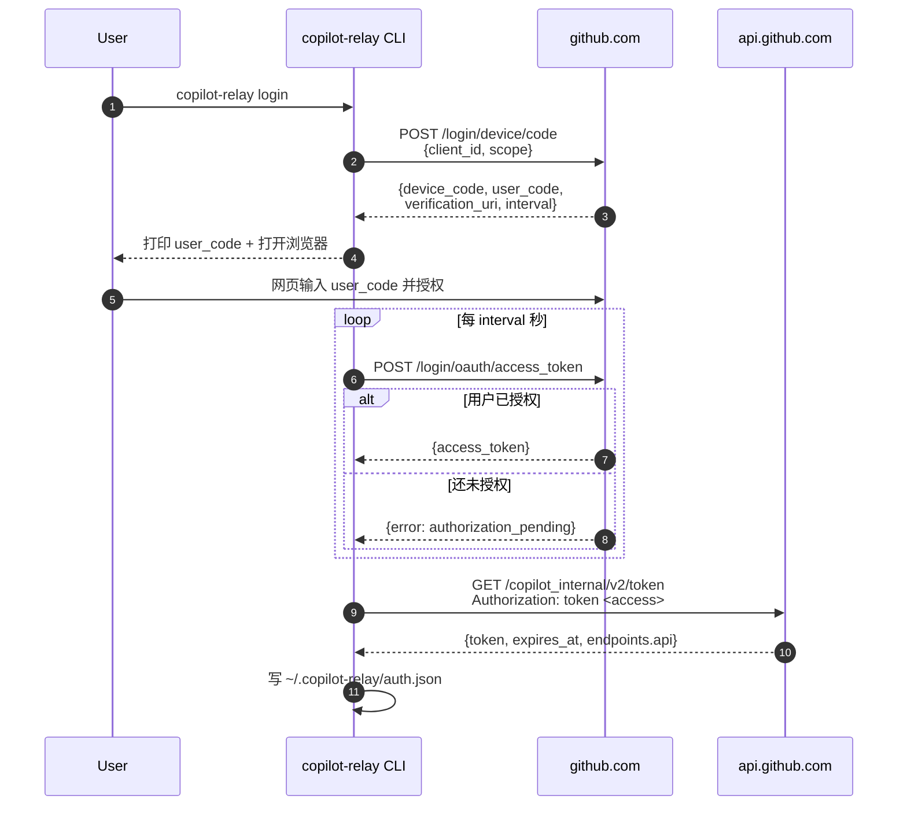
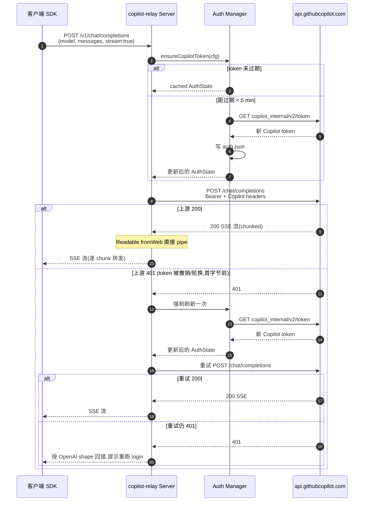

# copilot-relay — Design (v0.1)

> 与 [requirement.md](./requirement.md) 对齐;若二者冲突以 requirement.md 为准。

## 1. 架构总览

> [!NOTE]
> 本文档中的时序图与流程图使用 Mermaid 语法。在 VS Code 内右上角 "Open Preview" 或 `Ctrl+Shift+V` 查看渲染效果;需安装 `bierner.markdown-mermaid` 扩展(工作区已装)。GitHub 网页原生支持,无需额外配置。

## 2. 组件职责

| 模块 | 文件 | 职责 |
|---|---|---|
| CLI 前端 | [src/cli.ts](../src/cli.ts) | commander 命令解析、进程生命周期、pid 文件 |
| Config | [src/config.ts](../src/config.ts) | 默认配置 + `config.json` 读写,路径常量 |
| Logger | [src/logger.ts](../src/logger.ts) | 分级日志,统一写 stdout(不落盘、不轮转) |
| HTTP Server | [src/server.ts](../src/server.ts) | 路由分发、请求体读取、流式管道、错误封装 |
| Copilot Auth | [src/auth/copilot.ts](../src/auth/copilot.ts) | Copilot token 换取/刷新/过期判断/持久化 |
| Device Code | [src/auth/deviceCode.ts](../src/auth/deviceCode.ts) | GitHub OAuth device-code flow |
| OpenAI translator | [src/translate/openai.ts](../src/translate/openai.ts) | 构造上游 URL + 请求头 |
| Anthropic translator | [src/translate/anthropic.ts](../src/translate/anthropic.ts) | 同上,Anthropic 变体 |

## 3. 关键流程

### 3.1 首次登录 (device-code)

### 3.2 请求转发(以 OpenAI 为例)

## 4. 技术选型与取舍

| 决策 | 选择 | 备选 | 理由 |
|---|---|---|---|
| 语言 | TypeScript + `tsc` 编译 | ts-node / bun | 运行期零 loader,`node dist/*.js` 直接跑 |
| 模块系统 | ESM (`"type":"module"`) | CJS | `open@10` 为 ESM-only,绸定到整个包 |
| HTTP 客户端 | 内置 `fetch` (undici) | axios / node-fetch | 零依赖 + 原生流 |
| HTTP 服务端 | 内置 `node:http` | express / fastify | 3 条路由,自写 dispatch 反而更清晰 |
| CLI 参数 | `commander` | 手写 argv 解析 | `--help` 自动生成,subcommand 树,120 LOC 收益 |
| 打开浏览器 | `open` | 手写 spawn | 跨平台边界(macOS `open` / Linux `xdg-open` / Windows `start`)易踩坑 |
| 日志 | 自写 stdout | pino / winston | 只有 4 个 level,10 行 |
| 配置 | JSON | TOML/YAML | 无外部解析器需求;JSON.stringify 内置 |

## 5. 目录结构

见项目根 [README.md](../README.md) 和 [spec.md](./spec.md) §3。

## 6. 错误处理策略

与 requirement FR3/FR5/FR6 一一对应。

### 6.1 层级职责

| 层 | 策略 |
|---|---|
| CLI | 顶层 `.catch(err) => { logger.error; exit(1) }`;子命令内部允许抛异常 |
| HTTP handler | `handleRequest(...).catch(...)`,未写头时按客户端协议 shape 回错(见 6.2) |
| Auth | `loadAuth() → null` 时,`start` 命令报"请先 login" 并 exit(1) |

### 6.2 上游错误 → 客户端 shape (FR5)

**不得直接透传 Copilot 原始错误 body**。统一按目标路由的协议重写:

- OpenAI 端(`/v1/chat/completions`、`/v1/models`)→
  `{ error: { type, message, code } }`。
- Anthropic 端(`/v1/messages`)→
  `{ type: "error", error: { type, message } }`。

HTTP 状态码尽量透传上游;无法分类或本地报错时统一 `502`。

### 6.3 401 与 token 刷新 (FR3 + FR5)

- **主动刷新**:`ensureCopilotToken` 在距 `expires_at` ≤ 5 min 时拉新 token。
- **反应式刷新**:上游返回 401 时强制刷新一次并重试原请求(详见 3.2 alt 分支)。
  重试**仅允许在上游首个响应到达前**。若 SSE 已开始转发则不重试,
  按 6.4 终止流。
- **二次仍 401**:按 6.2 shape 透传给客户端,并在 stdout 提示重跑 `copilot-relay login`。
- **刷新自身失败**(长期 access_token 被 revoke):当前请求回 **401**
  (而非 500);`auth.json` 不覆写 refreshed 字段;`copilot-relay status`
  将读到过期状态并标记认证失效。

### 6.4 请求生命周期 (FR6)

- **客户端断开**:监听 `req.on("close")`,通过 `AbortController` 取消上游 `fetch`,
  避免白烧 Copilot 额度。
- **SSE 中途报错**:
  - OpenAI 端写入 `data: {"error": {...}}\n\n` 后 `res.end()`,
    **不发 `data: [DONE]`**(SDK 会把 `[DONE]` 当成功从而吞错)。
  - Anthropic 端写入 `event: error\ndata: {...}\n\n` 后 `res.end()`。
- 实现前需实测 `openai` / `@anthropic-ai/sdk` 对上述序列的行为。

## 7. 安全 (Security)

- **Token 不入日志**:即使 debug 级别也只打印前 8 字符。
- **auth.json chmod 0600**:类 Unix 生效。Windows 上不额外调用 `icacls`,
  依赖 `%USERPROFILE%` 目录本身的 ACL。
- **仅监听 127.0.0.1**:不绑 `0.0.0.0`,防止局域网直连使用他人 token。
  绑定地址**无对外配置入口**——config.json / 环境变量 / CLI flag 均不开放,
  只能改代码(与 requirement NFR7 对应)。
- **无 CORS**:代理为本机开发工具服务,浏览器场景不在范围内。

## 8. 扩展点 (Extension Points)

预留但**不实现**:

- **多后端**:`config.provider` 字段(v0.1 仅硬编码 copilot)。后续新增
  provider 后,`server.proxy()` 内根据 provider 分发到不同 translator。
- **模型路由**:目前直接把客户端传入的 `model` 字段透传。未来可加
  `modelMap` 配置项,把 `gpt-4o` 重写成 Copilot 端的具体模型 slug。
- **速率限制/审计**:预留 middleware 位置(`handleRequest` 前后),v0.1 不加。

## 9. 已知风险

| 风险 | 影响 | 应对 |
|---|---|---|
| Copilot 后端头格式变更 | 请求 4xx | 头值放在 config.json,用户可无侵入覆盖 |
| device-code client_id 被撤销 | login 失败 | 允许用户配置自己的 OAuth App id |
| Windows 上 chmod 无效 | auth.json 权限宽松 | 文档提示;依赖用户目录 ACL |
| 默认 `githubClientId` 合规性 | GitHub 侧可能限制第三方使用 | 允许用户自建 OAuth App 替换 |
