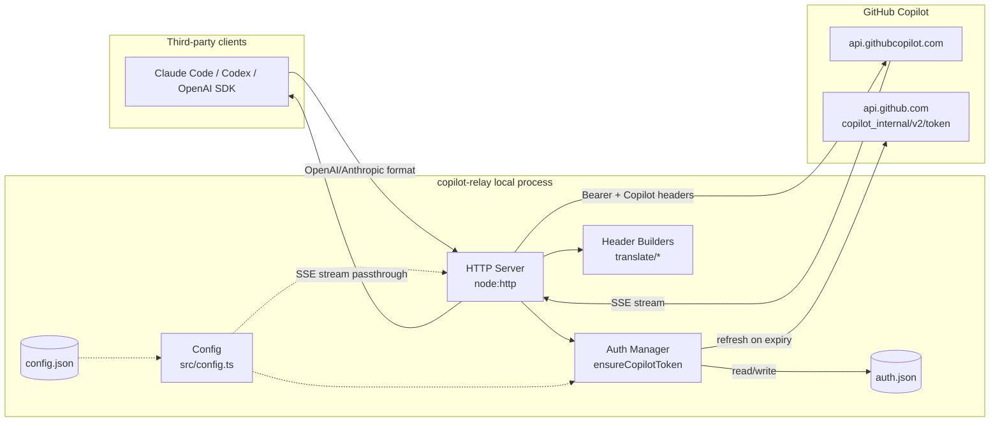
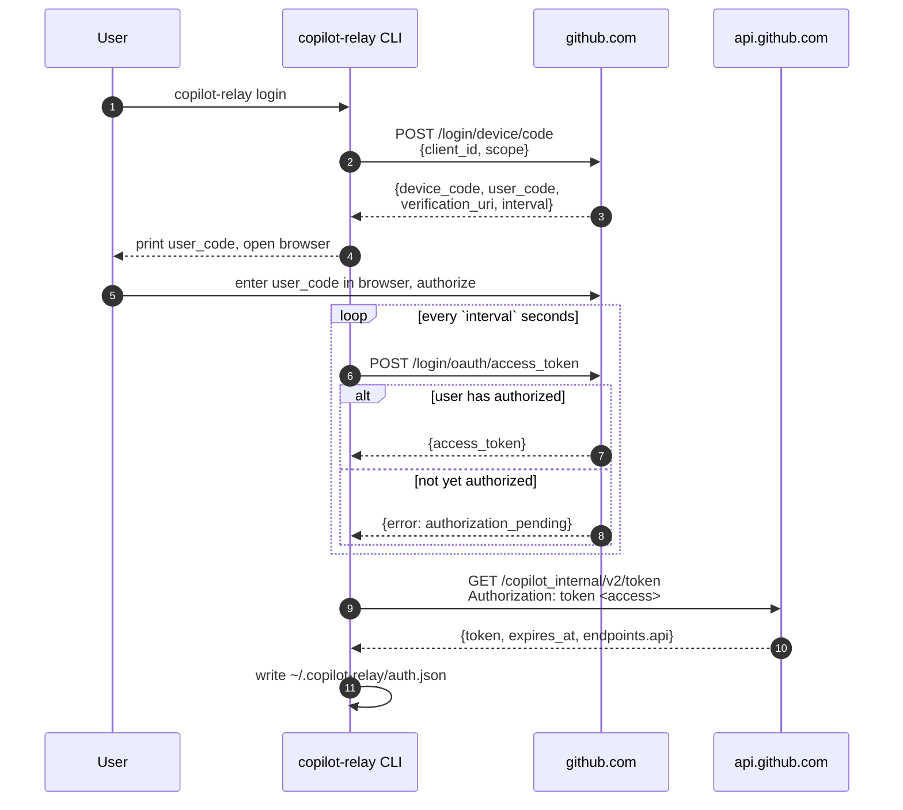
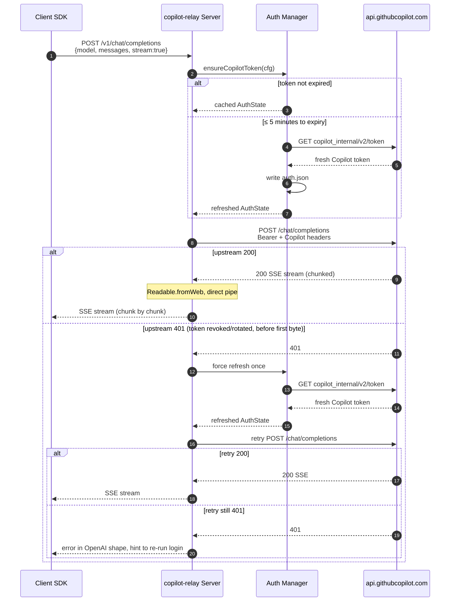

# copilot-relay — Design (v0.1)

> Aligned with [requirement.md](./requirement.md); when the two conflict, `requirement.md` wins.

> [!NOTE]
> Diagrams in this document use Mermaid syntax. Open the preview pane in VS Code (`Ctrl+Shift+V` or the button in the top-right) to view them rendered; the `bierner.markdown-mermaid` extension is required (installed in this workspace). GitHub renders Mermaid natively — no extra setup.

## 1. Architecture Overview

## 2. Component Responsibilities

| Module | File | Responsibility |
|---|---|---|
| CLI frontend | [src/cli.ts](../src/cli.ts) | commander parsing, process lifecycle, pid file |
| Config | [src/config.ts](../src/config.ts) | Default config + `config.json` read/write, path constants |
| Logger | [src/logger.ts](../src/logger.ts) | Leveled logging, writes to stdout only (no file, no rotation) |
| HTTP Server | [src/server.ts](../src/server.ts) | Route dispatch, request-body reading, streaming pipeline, error wrapping |
| Copilot Auth | [src/auth/copilot.ts](../src/auth/copilot.ts) | Copilot token exchange / refresh / expiry check / persistence |
| Device Code | [src/auth/deviceCode.ts](../src/auth/deviceCode.ts) | GitHub OAuth device-code flow |
| OpenAI translator | [src/translate/openai.ts](../src/translate/openai.ts) | Builds upstream URL + request headers |
| Anthropic translator | [src/translate/anthropic.ts](../src/translate/anthropic.ts) | Same, Anthropic variant |

## 3. Key Flows

### 3.1 First-time login (device-code)

### 3.2 Request forwarding (OpenAI example)

## 4. Technical Choices & Tradeoffs

| Decision | Choice | Alternatives | Rationale |
|---|---|---|---|
| Language | TypeScript + `tsc` compile | ts-node / bun | Zero runtime loader; `node dist/*.js` runs directly |
| Module system | ESM (`"type":"module"`) | CJS | `open@10` is ESM-only, forcing the whole package to be ESM |
| HTTP client | Built-in `fetch` (undici) | axios / node-fetch | Zero dependencies + native streams |
| HTTP server | Built-in `node:http` | express / fastify | Only 3 routes; hand-rolled dispatch is actually clearer |
| CLI parsing | `commander` | Hand-rolled argv parsing | Auto-generated `--help` and subcommand tree; saves ~120 LOC of hand-rolled parsing |
| Open browser | `open` | Hand-rolled `spawn` | Cross-platform edge cases (macOS `open` / Linux `xdg-open` / Windows `start`) are easy to get wrong |
| Logging | Home-grown stdout logger | pino / winston | Only 4 levels; ~10 lines of code |
| Config | JSON | TOML / YAML | No external parser needed; `JSON.stringify` is built in |

## 5. Directory Layout

See project root [README.md](../README.md) and [spec.md](./spec.md) §3.

## 6. Error Handling Strategy

Maps one-to-one to requirement FR3 / FR5 / FR6.

### 6.1 Layer responsibilities

| Layer | Strategy |
|---|---|
| CLI | Top-level `.catch(err => { logger.error(err); exit(1); })`; subcommands may throw freely |
| HTTP handler | `handleRequest(...).catch(...)`; if headers are not yet written, respond in the client's protocol shape (see §6.2) |
| Auth | When `loadAuth() → null`, the `start` command reports "please run login first" and `exit(1)` |

### 6.2 Upstream errors → client shape (FR5)

**Do not proxy Copilot's raw error body verbatim.** Rewrite to the target route's protocol:

- OpenAI endpoints (`/v1/chat/completions`, `/v1/models`) →
  `{ error: { type, message, code } }`
- Anthropic endpoint (`/v1/messages`) →
  `{ type: "error", error: { type, message } }`

Pass the upstream HTTP status through where possible; when unclassifiable or when the error originates locally, use `502`.

### 6.3 401 and token refresh (FR3 + FR5)

- **Proactive refresh:** `ensureCopilotToken` fetches a new token when the Copilot token's remaining lifetime is ≤ 5 minutes.
- **Reactive refresh:** on upstream 401, force-refresh once and retry the original request (see the alt branch in §3.2). Retry is **only allowed before the first upstream response byte arrives**. If SSE forwarding has already begun, do not retry — terminate the stream per §6.4.
- **Second 401:** pass through to the client using the shape from §6.2, and hint on stdout to re-run `copilot-relay login`.
- **Refresh itself fails** (long-lived access_token revoked): the current request responds with **401** (not 500). Only `lastRefreshError` is written to `auth.json`; the previously stored Copilot token fields (`copilotToken`, `copilotExpiresAt`, `copilotApiBase`) are left as-is (see [spec.md §4](./spec.md#4-authjson-schema)). `copilot-relay status` then observes the expired token plus the failure marker and flags auth as invalid.

### 6.4 Request lifecycle (FR6)

- **Client disconnect:** listen on `req.on("close")` and cancel the upstream `fetch` via `AbortController`, so Copilot quota is not wasted.
- **Error mid-SSE:**
  - OpenAI endpoint: write `data: {"error": {...}}\n\n` then `res.end()`. **Do not emit `data: [DONE]`** — the SDK treats `[DONE]` as success and would swallow the error.
  - Anthropic endpoint: write `event: error\ndata: {...}\n\n` then `res.end()`.
- These sequences assume the `openai` and `@anthropic-ai/sdk` clients treat `data: {"error": {...}}` (without a trailing `[DONE]`) as a stream error rather than success. Re-verify this invariant when upgrading either dependency.

## 7. Security

- **Tokens never appear in logs**: even at debug level, only the first 8 characters are printed.
- **`auth.json` chmod 0600**: applied on Unix-like systems. On Windows no `icacls` call is made — permission relies on the `%USERPROFILE%` directory's own ACL.
- **Listen on 127.0.0.1 only**: never bind `0.0.0.0`, to prevent LAN clients from using someone else's token. The bind address **has no user-facing configuration hook** — no config.json field, no env var, no CLI flag — only a code change (matches requirement NFR7).
- **No CORS**: the proxy serves local developer tooling; the browser scenario is out of scope.

## 8. Extension Points

Reserved but **not implemented in v0.1**:

- **Multiple backends:** `config.provider` field (v0.1 is hard-coded to copilot). Once new providers are added, `server.proxy()` dispatches to different translators by provider.
- **Model routing:** the client's `model` field is currently passed through verbatim. A future `modelMap` config option can rewrite (e.g.) `gpt-4o` to the specific Copilot model slug.
- **Rate limiting / audit:** middleware slot reserved (around `handleRequest`); not added in v0.1.

## 9. Known Risks

| Risk | Impact | Mitigation |
|---|---|---|
| Copilot backend header format changes | Requests fail with 4xx | Header values live in `config.json`; users can override without code changes |
| Copilot API endpoint path changes (e.g., `/copilot_internal/v2/token`) | Requests fail with 404 / connection error | No config hook currently; requires a code change and release |
| device-code `client_id` revoked | Login fails | Allow users to configure their own OAuth App id |
| Windows chmod is a no-op | `auth.json` permissions relaxed | Documented; relies on the user profile directory ACL |
| Default `githubClientId` compliance | GitHub may restrict third-party use | Users can substitute their own OAuth App |
