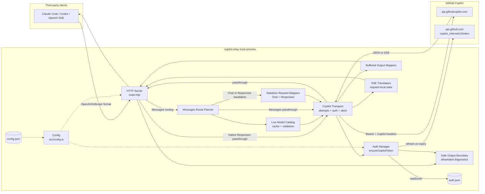
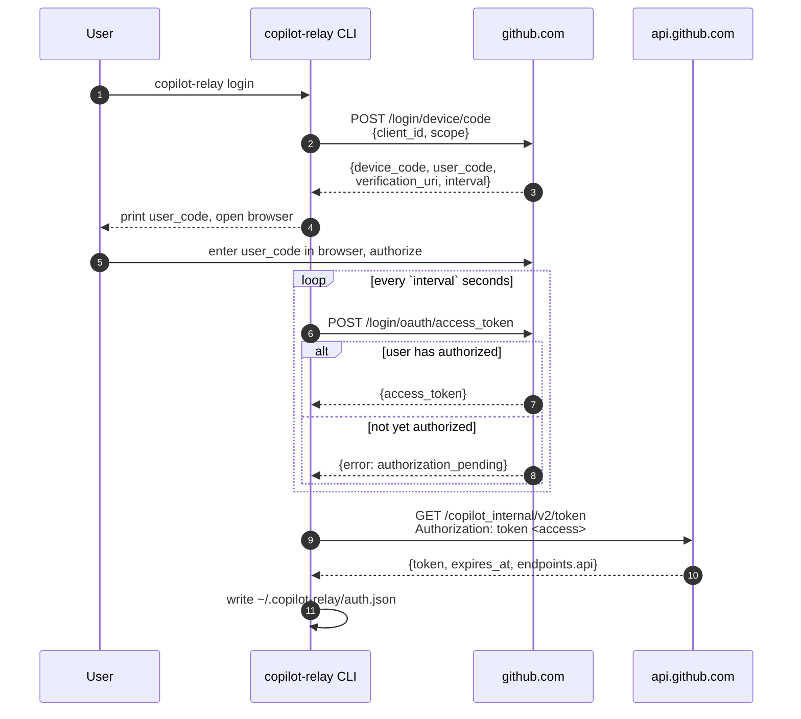
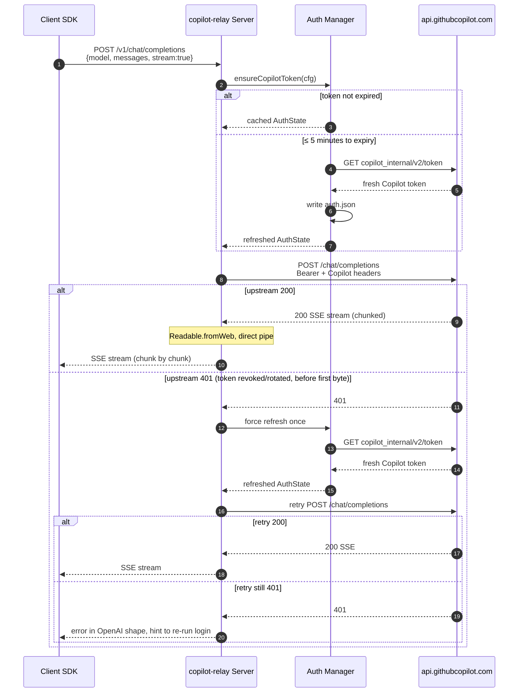
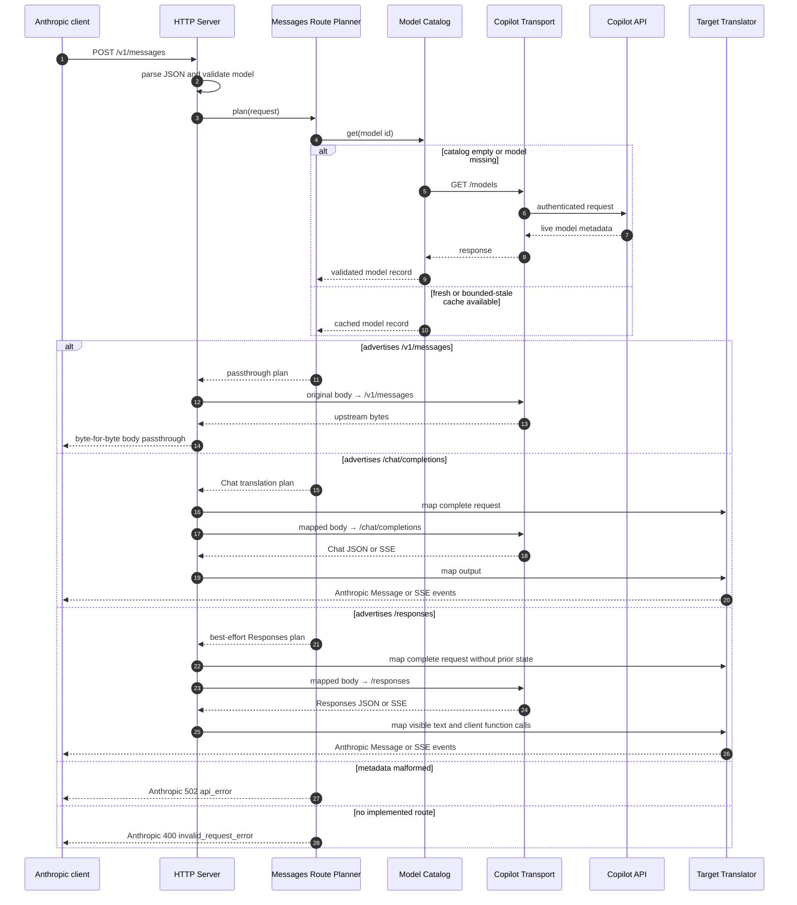
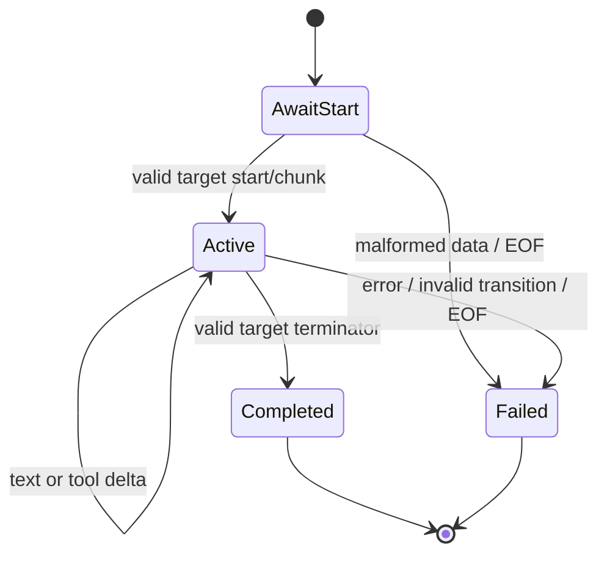

# copilot-relay — Design (v0.2)

> Status: approved 2026-08-24; amended 2026-09-15. Aligned with the approved [requirement.md](./requirement.md); when the two conflict, `requirement.md` wins.

> Decision record: [Native Responses v2](./native-responses-v2-decision.md), originating from [@xlight](https://github.com/xlight)'s [PR #1](https://github.com/luciferwww/copilot-relay/pull/1), records the independent native inbound `POST /v1/responses` route.

> Decision record: [Stateless Messages Translation](./stateless-messages-translation-decision.md) replaces translated-Messages continuation persistence with direct tool-id preservation. [Continuation Persistence](./continuation-persistence-decision.md) is retained only as a superseded historical record.

> Design principle: [Protocol Compatibility](./protocol-compatibility-principle.md) defines why every relay boundary is tolerant by default and identifies the integrity conditions that remain strict.

> [!NOTE]
> Diagrams in this document use Mermaid syntax. Open the preview pane in VS Code (`Ctrl+Shift+V` or the button in the top-right) to view them rendered; the `bierner.markdown-mermaid` extension is required (installed in this workspace). GitHub renders Mermaid natively — no extra setup.

## 1. Architecture Overview

## 2. Component Responsibilities

| Module | File | Responsibility |
|---|---|---|
| CLI frontend | [src/cli.ts](../src/cli.ts) | commander parsing, process lifecycle, pid file |
| Config | [src/config.ts](../src/config.ts) | Default config + `config.json` read/write, path constants |
| Logger / safe output | [src/logger.ts](../src/logger.ts) | Leveled structured logging and safe diagnostic rendering; accepts allowlisted fields rather than arbitrary objects or raw errors; writes to stdout only |
| HTTP Server | `src/http-server.ts` | Route dispatch, native Responses handling, client disconnect handling, protocol response selection |
| Copilot Auth | [src/auth/copilot.ts](../src/auth/copilot.ts) | Copilot token exchange / refresh / expiry check / persistence |
| Device Code | [src/auth/deviceCode.ts](../src/auth/deviceCode.ts) | GitHub OAuth device-code flow |
| Copilot transport | `src/upstream/CopilotTransport.ts` | Authenticated attempt execution, request-scoped retry bounds, abort propagation, common headers |
| Model catalog | `src/models/ModelCatalog.ts` | Fetches and validates live `/models` metadata; bounded cache and shared refresh |
| Messages route planner | `src/routing/messages-route.ts` | Selects native Messages, Chat translation, Responses translation, or a typed local error without changing model id |
| OpenAI translator | [src/translate/openai.ts](../src/translate/openai.ts) | Chat Completions passthrough headers and OpenAI error shape |
| Anthropic translator | [src/translate/anthropic.ts](../src/translate/anthropic.ts) | Messages passthrough headers and Anthropic error/SSE shape |
| Chat request/output mappers | `src/translate/chat/*` | Direct Anthropic Messages ↔ Chat Completions mapping with preserved function-call ids |
| Chat SSE translator | `src/translate/chat/SseTranslator.ts` | Incremental Chat chunk parsing and Anthropic event sequencing |
| Responses request mapper | `src/translate/responses/request-mapper.ts` | Stateless best-effort Anthropic Messages → Responses JSON mapping |
| Responses output mapper | `src/translate/responses/response-mapper.ts` | Non-streaming Responses → Anthropic Message mapping without publication state |
| Responses SSE translator | `src/translate/responses/SseTranslator.ts` | Incremental Responses SSE parsing with request-local state only |
| Translation types | `src/translate/shared.ts` and target-local modules | Shared failures and limits plus target-specific boundary types |

## 3. Key Flows

### 3.1 First-time login (device-code)

### 3.2 Request forwarding (OpenAI example)

### 3.3 Capability-routed Anthropic request

The planner is deterministic and side-effect free after catalog lookup. Endpoint priority is `/v1/messages`, `/chat/completions`, then HTTP `/responses`; `ws:/responses` is not an HTTP capability. No branch substitutes the requested model.

### 3.4 Translation stream lifecycle

The translation path validates and maps the complete inbound JSON body before opening the selected endpoint. After any successful upstream response body or downstream response begins, it never retries or switches routes; pre-body failures follow the restricted attempt-coordinator rules in §7.

For non-streaming calls, the output mapper reads one bounded JSON response and emits one Anthropic Message. For streaming calls, the SSE translator consumes arbitrary byte chunks, buffers only an incomplete SSE frame and bounded per-tool argument state, and emits Anthropic events as soon as their required source data is available.

Each target adapter validates the minimum envelope required to emit `message_start`. Request-local state owns Anthropic content-block indexes and bounded text or function-argument assembly keyed by the target's stream index. Conflicting indexes or ids, a required delta before its start, invalid final arguments, or a success terminator with incomplete translated blocks is a 502 protocol failure.

The state machine guarantees exactly one `message_start`, ordered start/delta/stop events for each block, one terminal `message_delta`, and one `message_stop` on success. A failure emits one Anthropic `error` event and closes without a success terminator.

### 3.5 Stateless tool history

Standard client function calls preserve one identity value across protocols. Chat maps Anthropic `tool_use.id` directly to `tool_calls[].id` and maps `tool_result.tool_use_id` back to `tool_call_id`. Responses maps the same Anthropic id to `function_call.call_id` and `function_call_output.call_id`. The relay never allocates a replacement id.

On every request, the mapper scans the submitted history and validates that each tool result has one unambiguous preceding tool call. It then reconstructs the target's ordinary assistant call and tool-result messages or items from the historical id, name, input, and result text. Missing, duplicate, conflicting, or out-of-order ids and invalid function arguments fail before transport; association is never guessed from names or text.

Responses reasoning items, encrypted content, target-specific item ids, and hosted-tool state are omitted when they have no Anthropic carrier. If a Responses model requires that state on the next turn, its rejection is terminal and safely rewritten for the Anthropic client. The relay does not persist the state, encode it into a tool id, use an upstream stored conversation, or switch models.

Only active-stream parsing and argument assembly are mutable. They are bounded, owned by one HTTP request, and discarded on completion, failure, timeout, or disconnect.

## 4. Technical Choices & Tradeoffs

| Decision | Choice | Alternatives | Rationale |
|---|---|---|---|
| Language | TypeScript + `tsc` compile | ts-node / bun | Zero runtime loader; `node dist/*.js` runs directly |
| Module system | ESM (`"type":"module"`) | CJS | `open@10` is ESM-only, forcing the whole package to be ESM |
| HTTP client | Built-in `fetch` (undici) | axios / node-fetch | Zero dependencies + native streams |
| HTTP server | Built-in `node:http` | express / fastify | Small fixed route surface; explicit dispatch remains clearer |
| CLI parsing | `commander` | Hand-rolled argv parsing | Auto-generated `--help` and subcommand tree; saves ~120 LOC of hand-rolled parsing |
| Open browser | `open` | Hand-rolled `spawn` | Cross-platform edge cases (macOS `open` / Linux `xdg-open` / Windows `start`) are easy to get wrong |
| Logging | Structured safe-output boundary over stdout | Free-form logger / pino / winston | A small allowlisted schema prevents credential-bearing objects and raw errors from reaching output surfaces |
| Config | JSON | TOML / YAML | No external parser needed; `JSON.stringify` is built in |
| Capability source | Live Copilot `/models` only | Static model table / name heuristics | Honors account-specific and changing upstream capabilities |
| Routing | Explicit route plan | Endpoint trial-and-error | Deterministic errors; client requests never become capability probes |
| Translation model | Direct Messages ↔ Chat and Messages ↔ Responses mappers | General canonical protocol | Two small explicit paths avoid a premature abstraction |
| SSE parsing | Incremental state machine | Buffer full response / regex replacement | Preserves time-to-first-event and handles arbitrary transport chunking |
| Mapper shape | Pure functions + typed errors | Translation inside HTTP handler | Keeps protocol behavior testable without coupling it to sockets |

## 5. Model Catalog and Routing

### 5.1 Source of truth

When the relay chooses a route or validates a translated feature, the live Copilot `/models` response is the sole runtime authority. `1.json` and other captures are test fixtures only and are never loaded by production code. Routing uses only exact entries from `supported_endpoints`; feature preflight uses explicit values from `capabilities.supports` and required bounds from `capabilities.limits`. Model id, family, vendor, picker state, and preview state are not capability signals. Native passthrough routes do not make capability decisions and leave endpoint acceptance to upstream.

Effective support is the intersection of upstream metadata and relay implementation. For example, a model declaring vision is insufficient until the selected translation path implements and validates image mapping.

### 5.2 Cache state

`ModelCatalog` keeps one immutable validated snapshot with a monotonically increasing generation, its fetch time, a generation-scoped negative-result map, and at most one in-progress refresh operation. The manager owns that operation's controller, deadline, promise, and waiter count; no client request owns or lends its deadline to the shared operation. Cache limits and deadlines are constants specified in `spec.md`; they are not user configuration in v0.2.

| State | Behavior |
|---|---|
| Fresh snapshot | Resolve without network access |
| Empty cache | Start a manager-owned refresh with its own deadline; concurrent callers await the same promise as independent waiters |
| Model absent | Reuse a negative result only for `(modelId, currentGeneration)`; otherwise force one shared refresh and record absence against the resulting generation |
| Refresh fails with bounded-stale snapshot | Use stale snapshot and log only age/status metadata |
| Refresh fails without usable snapshot | Return a 502 in the calling route's protocol shape |
| Response exceeds byte, record-count, or validated-cache limits | Abort the refresh; use bounded-stale data or return a route-shaped 502 |
| Required metadata malformed | Return a route-shaped 502; do not infer or probe |
| Verified pre-execution endpoint rejection | Invalidate, require a new generation without stale fallback, and re-plan once through the request attempt coordinator |

The cache stores the complete model records needed for endpoint and feature decisions. It does not mutate or enrich records with guessed defaults. Parsing uses a bounded body reader before JSON decoding, and a candidate snapshot is published atomically only after the complete response passes schema, record-count, and aggregate-size validation. A failed refresh never replaces a usable snapshot. Publishing a new generation atomically clears all earlier negative results. A request finding a refresh already in progress registers as a waiter and awaits that same promise before testing or recording its model-specific result. Client disconnect or request deadline removes only that waiter; it does not settle or reject the shared promise for other waiters. Because v0.2 has no background refresh, the manager aborts the operation when its own deadline expires or its waiter count reaches zero. Completion, last-waiter cancellation, abort, and generation publication race through one manager-owned terminal state so no result commits after cancellation. Normal snapshot expiry still triggers refresh, so a generation-scoped negative result cannot hide a newly published catalog indefinitely. Exact waiter bookkeeping and race rules belong in `spec.md`.

### 5.3 Route plans

The planner returns a discriminated union rather than performing network I/O:

- `messages-passthrough`: original bytes and Anthropic headers go to `/v1/messages`;
- `chat-translation`: validated mapping is required before `/chat/completions` is called;
- `responses-translation`: stateless best-effort mapping is required before `/responses` is called;
- `client-error`: known model/request with no supported implemented route, HTTP 400;
- `upstream-metadata-error`: missing or malformed required metadata, HTTP 502.

This union is the boundary that prevents fallback from becoming model substitution or endpoint guessing.

### 5.4 Native Responses route

Native inbound `POST /v1/responses` is handled beside, not inside, the Messages route planner. Because the client has already selected the Responses protocol, the handler validates the bounded request and non-empty model id, then invokes upstream `/responses` through `CopilotTransport` with the original admitted body and query. It does not consult `ModelCatalog`. Successful JSON and SSE use the OpenAI passthrough writer; Messages mappers are not involved.

The transport owns one pre-output 401 retry. Native Responses does not capability-replan or retry an upstream 400; non-2xx upstream bodies are safely rewritten rather than passed through.

### 5.5 External models route

Client-facing `GET /v1/models` is an independent request-owned passthrough through `CopilotTransport`. On success it pipes the upstream body byte-for-byte; it never serializes a validated `ModelCatalog` snapshot. Client disconnect or request deadline aborts only this passthrough operation.

The external route does not join an internal catalog refresh, share its response body, or publish a catalog generation. Conversely, `ModelCatalog` refreshes never borrow the external request's controller or deadline. Both paths may share the Auth Manager, but concurrent external and internal lookups may intentionally issue two upstream `/models` requests to keep body ownership, validation, caching, and cancellation independent. External-route error rewriting and its one 401 retry remain route-local contracts defined in `spec.md`; they do not consume a model invocation attempt.

## 6. Translation Pipeline

### 6.1 Request validation

The selected request mapper parses unknown JSON into boundary types and applies the compatibility order from `spec.md`: verified mapping, target-compatible passthrough, warning plus omission, or rejection when a trustworthy target request cannot be constructed. Required validation completes before the upstream call.

Validation combines protocol rules with the selected model record. Optional semantics without an implemented equivalent, such as `stop_sequences`, `top_k`, cache hints, images, documents, thinking blocks, and reasoning controls, are omitted with structured warnings when text or standard client tools remain. A boolean `tool_result.is_error` is consumed while its text maps to the target tool-result structure.

Compatibility stays in the boundary mappers rather than client-version branches. Unknown optional fields warn and are omitted, and target-shaped structures pass through only where they require no reinterpretation. Required request input and tool association remain strict.

When tool results are present, validation scans the submitted history. Each result must match one preceding tool use by exact id. The historical name and JSON input construct the target assistant call, followed by the target tool-result message or item using the same id. No lookup, publication, or authoritative hidden copy exists outside that request.

### 6.2 Non-streaming output

The output mapper maps text, standard client function calls, usage, and completion reason into one Anthropic Message. A target response model must equal the requested catalog id or append one `-YYYY-MM-DD` version suffix; the mapper always exposes the exact requested id to the Anthropic client. Unknown output/content variants warn and remain client-invisible. Structurally invalid required data still produces an Anthropic 502.

### 6.3 Streaming output

Each target SSE translator has two layers:

1. A transport parser converts arbitrary UTF-8 byte chunks into complete SSE events while preserving split code points and multi-line `data` fields.
2. A target-specific state machine converts documented events or chunks into ordered Anthropic events and accumulates only bounded tool-argument fragments until the relevant content block closes.

Unknown transport fields, auxiliary events, opaque output items, and unknown content parts warn and are ignored while translated blocks can still close coherently. Invalid transitions for translated text/function data, malformed JSON, excessive buffered state, and premature EOF remain upstream protocol failures.

## 7. Transport Boundary

`CopilotTransport` centralizes behavior currently embedded in `server.proxy()` and `proxyModels()`: proactive token acquisition, common headers, execution of an invocation plan, request deadlines, abort propagation, and returning the upstream `Response` before client headers are committed. It does not parse provider payloads, choose routes, or make a request-scoped controller own shared control-plane work.

One request-scoped attempt coordinator owns retry state and records `authRetryUsed`, `replanUsed`, the auth generation, catalog generation when applicable, route, and terminal state for every model invocation attempt. A model invocation is a call to `/chat/completions`, `/v1/messages`, or `/responses` made to generate a client result. No invocation retry is allowed after downstream output starts. Before output starts, an upstream 401 may consume the one auth retry. For capability-routed Messages only, HTTP 400 with machine-readable code `unsupported_api_for_model` may consume the one capability re-plan because FR9 verified that exact pair as pre-execution endpoint rejection. Native Responses and Chat Completions never capability-replan. A 400 without an applicable re-plan, timeout, connection reset, premature EOF, and any 5xx response are terminal and never replayed.

Each retry reason may be consumed at most once, and an attempt may transition to only one next attempt. The original call plus at most one auth-triggered invocation retry and one verified endpoint re-plan invocation gives a hard maximum of three model invocation attempts per client generation request, regardless of ordering. A repeated reason or any unclassified failure terminates the coordinator. “No downstream bytes” is therefore necessary but not sufficient for replay.

Token exchange and internal catalog refresh are control-plane operations, not model invocation attempts. Each manager gives those operations its own single-flight policy, deadline, waiter lifecycle, and call limit, all specified independently in `spec.md`. Route planning and re-planning also do not consume the invocation budget; only the resulting model endpoint call does. Client-facing `GET /v1/models` is neither a generation request nor a model invocation and uses its route-local retry bound from §5.4.

Passthrough success responses remain streamed byte-for-byte. Translation handlers copy only safe response headers and set the client protocol content type themselves. Body readers enforce byte limits while reading rather than after allocation. Translated streams propagate downstream backpressure to the upstream reader; they do not continue accumulating translated events while `ServerResponse.write()` is blocked. Abort, downstream close, writer failure, or translation failure cancels the unfinished upstream response body before its reader lock is released.

## 8. Directory Layout

See project root [README.md](../README.md) and [spec.md](./spec.md) §3.

## 9. Error Handling Strategy

Maps one-to-one to requirement FR3 / FR5 / FR6.

### 9.1 Layer responsibilities

| Layer | Strategy |
|---|---|
| CLI | Top-level catch converts a typed failure to a safe diagnostic code/message; it never passes an arbitrary `Error` or cause chain to the logger |
| HTTP handler | Selects the client protocol error formatter and renders only typed safe diagnostics, never raw thrown-error text |
| Auth | When `loadAuth() → null`, the `start` command reports "please run login first" and `exit(1)` |
| Model catalog / planner | Returns typed 400 or 502 failures; never writes an HTTP response directly |
| Request mapper | Returns typed 400 failures for unsupported or invalid client semantics |
| Output mapper / SSE translator | Returns or emits typed 502 failures for malformed upstream protocol |
| Transport | Reports typed HTTP, timeout, network, and auth outcomes without raw bodies or choosing a client error shape |

### 9.2 Upstream errors → client shape (FR5)

**Do not proxy Copilot's raw error body verbatim.** Rewrite to the target route's protocol:

- OpenAI endpoints (`/v1/chat/completions`, `/v1/responses`, `/v1/models`) →
  `{ error: { type, message, code } }`
- Anthropic endpoint (`/v1/messages`) →
  `{ type: "error", error: { type, message } }`

Pass the upstream HTTP status through where possible; when unclassifiable or when the error originates locally, use `502`.

Local capability errors are classified before transport: unknown model, unsupported valid route, and unsupported request semantics are 400; unavailable or malformed required model metadata is 502. Upstream error bodies may be read only through the bounded body reader and parsed solely to recognize machine-readable error codes explicitly allowlisted in `spec.md`; v0.2's endpoint re-plan allowlist contains only `unsupported_api_for_model` paired with HTTP 400. Client and log messages are locally constructed from the failure phase, HTTP status, allowlisted code, and an allowlisted request-id header when present; arbitrary upstream message text is never returned or logged.

### 9.3 401 and token refresh (FR3 + FR5)

- **Proactive refresh:** `ensureCopilotToken` fetches a new token when the Copilot token's remaining lifetime is ≤ 5 minutes.
- **Reactive refresh:** on upstream 401, force-refresh once and retry the original request (see the alt branch in §3.2). Retry is **only allowed before the first downstream response byte is written** and because the 401 establishes authentication rejection. If SSE forwarding has already begun, do not retry and terminate the stream per §9.4.
- **Second 401:** pass through to the client using the shape from §9.2, and hint on stdout to re-run `copilot-relay login`.
- **Definitive credential rejection:** a token-exchange status or documented error code that unambiguously means the long-lived access token is invalid maps to 401. Auth persistence records only a typed safe failure code and timestamp, leaves prior Copilot token fields as-is, and lets `status` report invalid auth without raw upstream text.
- **Transient or malformed refresh failure:** timeout, network failure, upstream 5xx, malformed success payload, and unrecognized failures map to 502. They preserve the prior auth-validity state, do not write a permanent invalid marker, and do not prompt for login. Unknown cases default to this non-credential class; `spec.md` defines the exact classification table.
- **Refresh concurrency:** the Auth Manager holds an immutable in-memory auth snapshot with a monotonically increasing generation and at most one manager-owned refresh operation for a source generation. The operation owns its controller, deadline, promise, and waiter count. Proactive callers from the same generation join as independent waiters. A reactive 401 records the generation of the token actually rejected: if a newer generation already exists, the request retries with it without another exchange; otherwise it starts or joins the refresh for the rejected generation. Client cancellation removes only that waiter; the operation continues for others and is aborted when its own deadline expires or its waiter count reaches zero. Exact terminal-race and call-limit rules belong in `spec.md`.
- **Generation-safe commit:** a refresh success, definitive rejection, or diagnostic state may commit only if its source generation is still current. Success atomically writes the new token state and advances the generation. A stale success or failure is discarded, so an older request cannot overwrite a newer token or mark it invalid. Transient failure never mutates persistent auth validity. Exact in-process initialization and persistence fields belong in `spec.md`.

### 9.4 Request lifecycle (FR6)

- **Invocation lifecycle owner:** each client request has one owner that combines `req.aborted`, a premature downstream response `close`, and the applicable request deadline into one controller for its model invocation or external passthrough. A normal request-stream `close` after the body is read is not by itself treated as client cancellation.
- **Control-plane waiters:** waiting for Auth Manager or `ModelCatalog` registers a request-local waiter cancellation hook rather than passing the invocation controller into the shared operation. Request cancellation stops that request from awaiting or starting a later invocation; manager-owned deadlines and last-waiter policy govern the shared operation itself.
- **Backpressure:** passthrough uses stream piping; translation awaits downstream `drain` whenever `write()` returns false before reading and translating more upstream bytes.
- **Single termination:** success, typed failure, timeout, upstream abort, and client disconnect race through one terminal state. Before headers, a local/upstream timeout returns the client protocol's 502 shape. After streaming starts, a timeout follows the mid-stream error rule when the socket remains writable. Client disconnect closes silently. No path writes an error after success or after socket closure.
- **Cleanup:** completion removes request/response listeners, clears deadline timers, releases stream readers, and aborts unfinished upstream work exactly once.
- **Error mid-SSE:**
  - OpenAI endpoint: write `data: {"error": {...}}\n\n` then `res.end()`. **Do not emit `data: [DONE]`** — the SDK treats `[DONE]` as success and would swallow the error.
  - Anthropic endpoint: write `event: error\ndata: {...}\n\n` then `res.end()`.
- These sequences assume the `openai` and `@anthropic-ai/sdk` clients treat `data: {"error": {...}}` (without a trailing `[DONE]`) as a stream error rather than success. Re-verify this invariant when upgrading either dependency.

## 10. Security

The HTTP boundary assigns a process-local request id and emits one terminal info event for every admitted request. Success and failure events use the same allowlisted schema: method, normalized path, model id when available, route/endpoint when selected, HTTP status, duration, and failure phase/code. Debug mode may add message-role/content-kind/block-count summaries, stream/tools counts, invocation count, and auth-retry/re-plan booleans. The logger API accepts these typed scalars and arrays of enums/counts only; call sites cannot pass request/response objects, headers, bodies, block values, tool values, `Error` instances, or cause chains.

- **Credentials never appear in output**: access tokens, Copilot tokens, authorization headers, image data, and credential substrings are excluded from logs, CLI output, client errors, and thrown-error messages at every log level. Status output includes only authentication state and expiry metadata.
- **Safe values are constructed, not scrubbed after formatting**: auth, transport, and protocol layers return typed diagnostic codes plus allowlisted scalar metadata such as HTTP status, model id, cache age, and failure phase. Raw headers, bodies, request payloads, token-exchange payloads, `Error` objects, cause chains, and auth-state objects are not accepted by logger or client-error APIs.
- **Defense-in-depth redaction**: the output boundary tracks current and replaced credential values and removes complete known values and authorization-header forms from any exceptional fallback string. This is not the primary guarantee: ordinary output paths never receive secret-derived text, so token prefixes and other value-derived fragments cannot be emitted. Persisted diagnostics use the same typed safe representation.
- **`auth.json` chmod 0600**: applied on Unix-like systems. On Windows no `icacls` call is made — permission relies on the `%USERPROFILE%` directory's own ACL.
- **Loopback by default; explicit remote opt-in**: bind `127.0.0.1` unless `host` is configured or supplied by CLI. A non-loopback host is rejected unless that same start command includes `--allow-remote-access`; this acknowledgement is never persisted. Remote listeners have no inbound authentication, so Docker/VM users must provide their own network isolation.
- **No CORS**: the proxy serves local developer tooling; the browser scenario is out of scope.
- **Bounded untrusted input**: request bodies, SSE frames, tool arguments, error bodies, and model metadata are subject to limits defined in `spec.md`; limits are checked before unbounded allocation or logging.

## 11. Extension Points

Reserved but **not implemented in v0.2**:

- **Multiple backends:** `config.provider` remains Copilot-only. A future backend must provide its own transport and capability source rather than weakening the live-metadata contract.
- **Additional protocol pairs:** require a separate decision; this design does not introduce a general canonical protocol.
- **Additional transports:** `ws:/responses` may be implemented separately; its advertisement never activates the HTTP Responses path.
- **Rate limiting / audit:** middleware slot reserved around request dispatch; not added in v0.2.

## 12. Test Strategy

- Route-planner tests cover priority, unsupported endpoints, malformed metadata, and exact model-id preservation.
- Each translated target has one representative request/response fixture and one complete id-preserving tool round trip.
- One streaming fixture splits an SSE frame and tool arguments across awkward transport boundaries and verifies one mid-stream failure.
- Existing transport, model-catalog, lifecycle, native-route, and security tests remain where their public contracts are unchanged; deleted continuation tests are removed rather than rewritten.
- Add tests only for a distinct public contract, an observed upstream variant, or a reproduced regression. Do not build field-permutation matrices or test private helper structure.
- Live Copilot probes remain separate from deterministic automated tests and cover only the minimum evidence in requirement FR9.

## 13. Known Risks

| Risk | Impact | Mitigation |
|---|---|---|
| Copilot backend header format changes | Requests fail with 4xx | Header values live in `config.json`; users can override without code changes |
| Copilot API endpoint path changes (e.g., `/copilot_internal/v2/token`) | Requests fail with 404 / connection error | No config hook currently; requires a code change and release |
| device-code `client_id` revoked | Login fails | Allow users to configure their own OAuth App id |
| Windows chmod is a no-op | `auth.json` permissions relaxed | Documented; relies on the user profile directory ACL |
| Default `githubClientId` compliance | GitHub may restrict third-party use | Users can substitute their own OAuth App |
| `/models` metadata is missing or inconsistent | Valid models cannot be routed | One refresh, bounded-stale cache, explicit 502; never guess |
| Concurrent auth refreshes complete out of order | New token or validity state is overwritten | Generation-scoped single-flight and compare-before-commit |
| Copilot translated endpoint differs from its public OpenAI shape | Translation fails | Minimal live probes establish the implemented text and client-function paths |
| A Responses model requires opaque state absent from Anthropic history | A translated tool-result turn fails | Return an actionable error; prefer Chat when advertised; never persist or fabricate the missing state |
| Unknown or reordered SSE events | Version drift or invalid Anthropic stream | Ignore and warn for auxiliary unknown events; keep strict ordering and closure checks for translated state |
| Slow or disconnected downstream accumulates translated output | Memory growth and wasted quota | Backpressure-aware writes, deadlines, bounded parser state, unified abort cleanup |
| Translation retry duplicates model execution | Duplicate model work or tool call | Retry only for 401 or probed pre-execution endpoint rejection; ambiguous failures are terminal; one coordinator caps total attempts |
